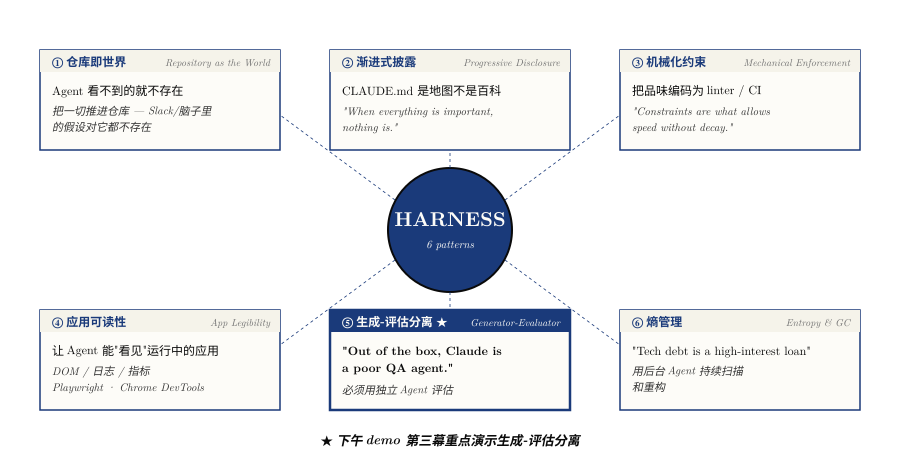

# 2 · Harness 的 6 大设计模式

> 综合 Anthropic 和 OpenAI 4 篇博客 + Claude Code 源码分析后提炼出的**跨公司共识**。
>
> 这 6 个模式适用于任何 LLM-based 系统，不限于 Claude Code。



## ① 仓库即世界 (Repository as the Agent's World)

### OpenAI 的核心发现

> "*From the agent's point of view, anything it can't access in-context while running effectively does not exist.*"

Slack 里的讨论、Google Docs 里的决策、人脑中的假设——**对 Agent 来说都不存在**。只有仓库里版本化的文件（代码、Markdown、Schema、执行计划）才是它的全部认知。

### 实践

- 架构对齐的 Slack 讨论？→ 写成 design doc 提交
- 团队达成的 convention？→ 写成 linter 规则提交
- 产品需求？→ 写成 product spec 提交

### 在这个 kit 里的体现

- `CLAUDE.md` 是 Agent 的"项目说明书"
- `MEMORY.md` 是 Agent 的"长期记忆"
- 所有 spec / template / 工作流都在仓库里有物理对应

## ② 渐进式披露 (Progressive Disclosure)

### 问题

给 Agent 太多上下文会适得其反。OpenAI 踩过这个坑：

> "*One big AGENTS.md approach failed. When everything is 'important', nothing is.*"

巨大的指令文件挤占了任务、代码和文档的上下文空间，反而降低 Agent 能力。

### 解决方案

**AGENTS.md / CLAUDE.md 是目录表，不是百科全书**。

```
CLAUDE.md           ← ~100 行，指向更深的知识源
ARCHITECTURE.md     ← 顶层架构概览
docs/
├── design-docs/
├── exec-plans/
│   ├── active/
│   └── completed/
├── product-specs/
└── references/
```

Agent 从小而稳定的入口开始，被教会"下一步去哪里看"。

### 在这个 kit 里的体现

- `MEMORY.md` 是索引（≤ 200 行）
- `memory/` 下每条记忆是独立 .md 文件
- `templates/` 按需引用而非全量加载

## ③ 机械化约束 (Mechanical Enforcement)

### OpenAI 的回答

> "*Documentation alone doesn't keep a fully agent-generated codebase coherent.*"

文档和 convention 在高吞吐量下迅速腐烂。把品味编码为代码：

```
每个业务域内部的分层规则：
Types → Config → Repo → Service → Runtime → UI
↑ 只能向前依赖，不能反向
```

并用 custom linter 机械化执行。

### 关键洞见

> "*Constraints are what allows speed without decay.*"

在人类工程中，这种严格约束会被嫌"太死板"。在 Agent 工程中，它们变成了**乘数**——"once encoded, they apply everywhere at once."

### 在这个 kit 里的体现

- 命名规则（`papers/YYYY-<slug>.md`）= 物理约束
- spec.yaml 的 schema = 机械化约束
- pre-commit hook（如果配）= 自动化约束

## ④ 应用可读性 (Application Legibility)

### 问题

Agent 能写代码，但不能"看到"运行中的应用。

### 方案

让应用本身对 Agent 可读：
- Chrome DevTools Protocol → Agent 操作 DOM、截图、导航
- 本地可观测性栈（logs + metrics + traces）→ Agent 用 LogQL / PromQL 查
- Playwright / Selenium → Agent 像真用户一样测

### 引文

> "*Prompts like 'ensure service startup completes in under 800ms' or 'no span in these four critical user journeys exceeds two seconds' become tractable.*"

### 在 AI 研究里的对应

- Tensor / loss / gradient 的可视化（wandb / tensorboard）→ Agent 能"看见" 训练
- 模型输出样本（generation log）→ Agent 能"读到" 模型在说什么
- pytest 的 verbose 输出 → Agent 能"看见" 测试是怎么失败的

## ⑤ 生成-评估分离 (Generator-Evaluator Split)

### 问题

Agent 对自己的产出**自我感觉良好**。

### Anthropic 的诊断

> "*Out of the box, Claude is a poor QA agent.*"
> — Prithvi Rajasekaran, Anthropic, 2026-03

### 方案：将"做事"和"评判"分给不同的 Agent

受 GAN 启发：

```
┌──────────┐     Spec      ┌──────────┐    Sprint     ┌──────────┐
│ Planner  │──────────────→│Generator │──────────────→│Evaluator │
│          │               │          │←──────────────│          │
└──────────┘               └──────────┘               └──────────┘
```

OpenAI 推到极致——"Ralph Wiggum Loop": Agent 写代码 → Agent review 代码 → 循环直到所有 reviewer 满意。

### 在这个 kit 里的体现

- [`templ-3`](../02-prompts/templ-3-run-experiment.md) 强制要求 sub-agent reviewer
- [`stage_5_eval`](../03-pipeline/5-evaluate/) 的 L3 = 独立 reviewer agent
- [`reproduce-rope-tdd` example](../04-examples/reproduce-rope-tdd/) 里的故意翻车演示

### 关键纪律

**永远不让生成的 Agent 评自己**——Self-Evaluation Bias 是模型行为，不是 prompt 问题。

## ⑥ 熵管理 / 垃圾回收 (Entropy & Garbage Collection)

### OpenAI 的独特贡献

> "*Codex replicates patterns that already exist in the repository—even uneven or suboptimal ones. Over time, this inevitably leads to drift.*"

最初他们每周五花 20% 时间清理 "AI slop"。不可持续。

### 方案

**Golden Principles + 自动化垃圾回收**：

- 把品质原则编码进仓库
- 定期用后台 Codex 任务扫描偏差、更新质量评分、开重构 PR
- "Most of these can be reviewed in under a minute and automerged"

> "*Technical debt is like a high-interest loan: it's almost always better to pay it down continuously in small increments than to let it compound.*"

### 在 AI 研究里的对应

- 每月跑一次 Agent 扫描所有 paper notes，找重复 / 矛盾 / 过时的内容
- 每月扫描所有 spec.yaml，找已经被 IMPROVEMENT.md 教训覆盖但未更新的实验
- 每季度跑一次"知识库健康度审查"

### 在这个 kit 里的体现

- `IMPROVEMENT.md` 是熵管理的物理实体——失败教训沉淀的地方
- DDD 4 文档体系本身就是为了防止知识熵增

## 6 模式如何配合使用

在一个完整的 Harness 系统里：

1. **仓库即世界** 提供"什么是真理"的物理边界
2. **渐进式披露** 让 Agent 不被信息淹没
3. **机械化约束** 防止 Agent 走偏
4. **应用可读性** 让 Agent 能感知运行时状态
5. **生成-评估分离** 防止 self-praise bias
6. **熵管理** 防止系统长期腐烂

**6 个都做不容易，但每多一个，回报指数级**。

## 推荐阅读

- [01 · 什么是 Harness](./01-what-is-harness.md) — 概念基础
- [03 · 3 层成熟度](./03-three-maturity-levels.md) — 你目前用上几个模式？
- [References](./references.md) — 4 篇核心博客的原文链接
