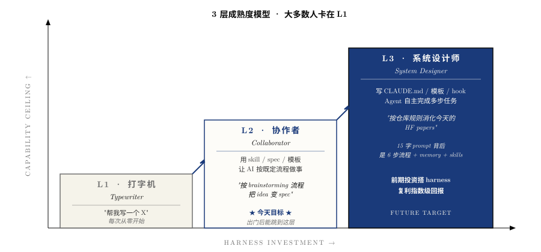

# 3 · 3 层成熟度模型

> 用 AI 工具不是布尔值，是个**层级**。这一章帮你定位自己在哪一层。

## L1 · 打字机（Typewriter）

### 典型行为

每次想到任务就打 prompt，看一行结果，改一行。

### 典型 prompt

> "帮我写一个 X"
>
> "这段代码有什么问题？"
>
> "怎么用 Python 实现 Y？"

### 瓶颈

- **每次都从零开始**：背景要重讲，偏好要重说
- 输出质量上限取决于你 prompt 写得多详细
- 跨会话没有积累——上次跟 AI 讨论的内容下次完全失忆

### 你的状态

90% 的 AI 用户在这一层。**这不丢人**——但确实是个天花板。

## L2 · 协作者（Collaborator）

### 典型行为

开始用 skill / spec / 模板，让 AI 按既定流程做事。

### 典型 prompt

> "按 brainstorming 流程帮我把 idea 变成 spec"
>
> "用 templ-1 模板帮我读这篇 paper"
>
> "按 CLAUDE.md 的 paper reading workflow 处理"

### 配置

- 有 `CLAUDE.md` / `.cursorrules` / `AGENTS.md`
- 至少 1-2 个常用 prompt 模板
- 简单的 MEMORY.md 或类似的跨会话记忆

### 瓶颈

仍需要人介入每一步——AI 不会自主决策"下一步该做什么"。

### 你的状态

如果你已经在这一层：**今天的目标就达到了**。

## L3 · 系统设计师（System Designer）

### 典型行为

写 CLAUDE.md / 模板 / hook，让 Agent 在你预设好的环境里**自主完成多步任务**。

### 典型 prompt

> "按仓库规则消化今天的 HF papers"
>
> "运行 spec.yaml 定义的实验，如果某层评测失败，自动起 reviewer 找 bug"

这一句话背后是 6 步流程已经写在 CLAUDE.md 里。

### 配置

- 完整 4 件套（CLAUDE.md + MEMORY + templates + tools.sh）
- 定义良好的 spec.yaml schema
- Generator-Evaluator 分离的多 Agent 架构
- 可能有 hook 系统（pre-commit / pre-push 钩子让 Agent 自动校验）

### 瓶颈

**前期要投资搭 harness**。可能需要几周到几个月才能 ROI 回正——但搭好之后回报指数级。

### 你的状态

少数研究员 / 工程师在这一层。**这是 AIDLC Phase 3 的目标状态**。

## 怎么知道自己在哪一层？

回答这 5 个问题：

| # | 问题 | L1 | L2 | L3 |
|---|---|---|---|---|
| 1 | 跨会话记忆有沉淀吗？ | 没 | 有几行 | 完整 memory 系统 |
| 2 | 有项目级规则书吗（CLAUDE.md / .cursorrules）？ | 没 | 简单的 | 完整且持续更新 |
| 3 | 有 prompt 模板吗？ | 没 | 几个 | 全套 + 实测过的 |
| 4 | 让 AI 评 AI 吗？ | 不会想到 | 偶尔 | 默认动作 |
| 5 | 有 spec-driven 流程吗？ | 没 | 知道但少用 | 标准动作 |

- ≤ 1 个 yes：L1
- 2-3 个 yes：L1.5 - L2
- 4-5 个 yes：L2 - L3

## 升级路径

### L1 → L2

跟着 [01-quickstart](../01-quickstart/) 跑 30 分钟即可：
- 写 `CLAUDE.md`
- 建 `MEMORY.md` + 1-2 个 memory 文件
- 用 [templ-1](../02-prompts/templ-1-read-paper.md) 读下一篇 paper

**这是今天分享的目标**。

### L2 → L3

更长期，可能需要几个月：
- 建 spec.yaml driven 的实验流程
- 搭 sub-agent reviewer
- 整理出领域专属的 pipeline recipes
- 让 Agent 的产出**真的可以 git clone 即跑**

### 永远不要追求 L3 全栈

**L3 不是越多越好**。"复杂度匹配任务"——简单任务用 L1 / L2 就够，强行套 L3 反而拖慢。

> "*Find the simplest solution possible, and only increase complexity when needed.*"
> — Justin Young, Anthropic, 2025-11

## 反向警告

### L1.5 ≠ L2

很多人买了 ChatGPT Pro / Claude Pro 就觉得自己是"高级用户"——**这只是工具升级，不是成熟度升级**。

L1.5 = L1 + 更好的模型。仍然没有 harness 基础设施。

### L3 ≠ "全自动 AI 写代码"

L3 不是"AI 完全替代你"，是"**AI 在你预设好的边界内自主决策**"。**你仍然是 steer 的人**。

> "Humans steer. Agents execute."

## 推荐阅读

- [01 · 什么是 Harness](./01-what-is-harness.md)
- [02 · 6 大设计模式](./02-six-patterns.md)
- [04 · Pipeline 总览](./04-pipeline-overview.md)
