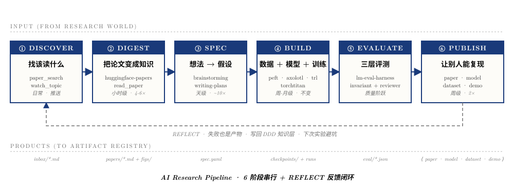

# AI Research Harness

> 用 Harness 工程做科研的 starter kit · A starter kit for doing research with AI harnesses
>
> 配套分享：[《用好 AI 工具做科研：从 Prompt 到 Harness》](./06-slides/slides.html)

---

## 🇨🇳 这是什么

一份**让你 30 分钟内把"用 AI 做科研"从 L1 (打字机) 升级到 L2 (协作者) 的 starter kit**。

不是教你怎么写 prompt，是教你怎么搭"包在 LLM 外面的工程系统"——也就是 **Harness**。

> "Humans steer. Agents execute." — Ryan Lopopolo, OpenAI · 2026-02

### 解决什么问题

如果你在用 AI 做研究时遇到下面任何一个，这个仓库就是给你的：

- 🔁 每次开新会话都要重新介绍背景，prompt 越写越长
- 🤡 AI 写出来的代码自己说"完美"，跑起来错的
- 📚 读论文不结构化，3 个月后自己都看不懂自己的笔记
- 🧪 实验做完无 audit trail，别人无法复现你做了什么
- 🎲 用 AI 像"开盲盒"，没有可重复的工作流

### 你能从这里拿到什么

| 你想做的事 | 去哪找 |
|---|---|
| 30 分钟跑通"用 AI 做科研"的最小工作流 | [`01-quickstart/`](./01-quickstart/) |
| 找具体能抄的 prompt 模板 | [`02-prompts/`](./02-prompts/) |
| 看 6 阶段 AI 研究 pipeline 怎么落地 | [`03-pipeline/`](./03-pipeline/) |
| 看完整 working examples（读论文/写笔记/复现实验） | [`04-examples/`](./04-examples/) |
| 系统学 Harness 概念 | [`05-docs/`](./05-docs/) |
| 看分享 slides 原版 | [`06-slides/`](./06-slides/) |

### 30 秒 Quick Start

```bash
# 1. 用 GitHub "Use this template" 创建你自己的研究项目仓库
#    或直接 clone：
git clone https://github.com/<your-username>/ai-research-harness my-research
cd my-research

# 2. 把 01-quickstart 的 4 件套移到根目录
cp 01-quickstart/CLAUDE.md ./
cp 01-quickstart/MEMORY.md ./
cp -r 01-quickstart/memory ./
cp -r 01-quickstart/templates ./
cp 01-quickstart/tools.sh ./

# 3. 启动 Claude Code（或 Cursor / Codex）
claude  # 或你用的任何 AI coding 工具

# 4. 试一句：
#    "按 CLAUDE.md 的 paper reading workflow，
#     帮我读今天 HF Daily Papers 上最热的一篇"
```

完整指南见 [`01-quickstart/README.md`](./01-quickstart/README.md)。

### 一图总览：6 阶段 AI 研究 pipeline



---

## 🇬🇧 What is this

A **starter kit to upgrade your "AI for research" workflow from L1 (typewriter) to L2 (collaborator) in 30 minutes**.

This isn't about writing better prompts. It's about building the engineering system *around* the LLM — what we call **Harness**.

> "Humans steer. Agents execute." — Ryan Lopopolo, OpenAI · 2026-02

### What problem does it solve

You should be here if any of these apply:

- 🔁 Every new session you re-explain context; prompts keep growing
- 🤡 AI writes code, claims "perfect", but it's actually broken
- 📚 Paper notes you wrote 3 months ago are unreadable today
- 🧪 No audit trail — nobody can reproduce what you did
- 🎲 Using AI feels like opening a blind box, no repeatable workflow

### What you'll find

| Goal | Path |
|---|---|
| 30-min hands-on starter | [`01-quickstart/`](./01-quickstart/) |
| Concrete prompt templates | [`02-prompts/`](./02-prompts/) |
| 6-stage research pipeline recipes | [`03-pipeline/`](./03-pipeline/) |
| Full working examples | [`04-examples/`](./04-examples/) |
| Concept docs | [`05-docs/`](./05-docs/) |
| Original talk slides | [`06-slides/`](./06-slides/) |

### Quick Start

```bash
git clone https://github.com/<your-username>/ai-research-harness my-research
cd my-research
cp 01-quickstart/CLAUDE.md ./
cp 01-quickstart/MEMORY.md ./
cp -r 01-quickstart/{memory,templates} ./
cp 01-quickstart/tools.sh ./
claude
```

See [`01-quickstart/README.md`](./01-quickstart/README.md) for the full guide.

---

## 📚 References & Inspiration

Built on the shoulders of:

- Anthropic · [Effective Harnesses for Long-Running Agents](https://www.anthropic.com/engineering/effective-harnesses-for-long-running-agents) (Justin Young, 2025-11)
- Anthropic · [Harness Design for Long-Running Application Development](https://www.anthropic.com/engineering/harness-design-long-running-apps) (Prithvi Rajasekaran, 2026-03)
- OpenAI · [Harness Engineering](https://openai.com/index/harness-engineering/) (Ryan Lopopolo, 2026-02)
- OpenAI · [Unlocking the Codex Harness](https://openai.com/index/unlocking-the-codex-harness/) (Celia Chen, 2026-02)
- AWS · [AIDLC Workflows](https://github.com/awslabs/aidlc-workflows) — DDD + SDD + TDD methodology stack

Full reading list: [`05-docs/references.md`](./05-docs/references.md)

---

## 🤝 Contributing

We welcome:

- **Case studies**: how you / your lab use this kit (open an [issue](./.github/ISSUE_TEMPLATE/case-study.md))
- **New templates**: pipeline recipes for new domains (open an [issue](./.github/ISSUE_TEMPLATE/new-template.md))
- **Doc improvements**: spotted unclear writing or wrong info? PR welcome
- **Translations**: especially to languages other than 中文/English

See [CONTRIBUTING.md](./CONTRIBUTING.md) for details.

---

## 📜 License

MIT — see [LICENSE](./LICENSE). Use it for anything, attribution appreciated but not required.

---

## 🌱 Credits

Started by sharing with master's students at [your institution]. Built on top of:
- [Claude Code](https://claude.ai/code) by Anthropic
- [superpowers](https://github.com/anthropics/skills/tree/main/superpowers) skills
- [html-ppt](https://github.com/lewislulu/html-ppt-skill) for the slides
- AIDLC by AWS
- 4 harness blog posts from Anthropic + OpenAI

If this helps your research, ⭐ the repo and pass it on to your lab.
