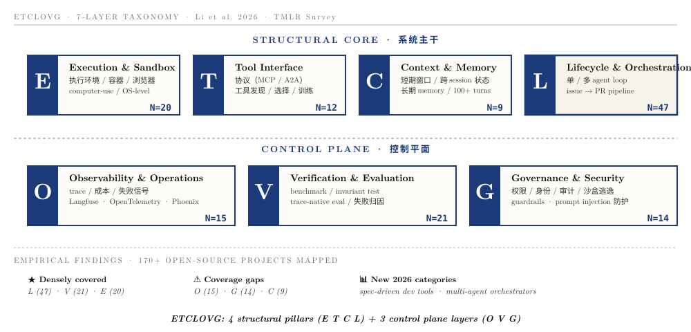

# AI Research Harness

[](./LICENSE)
[](https://github.com/IanLiYi1996/ai-research-harness/generate)
[](./06-slides/slides.html)
[](./CHANGELOG.md)

> 用 Harness 工程做科研的 starter kit · A starter kit for doing research with AI harnesses
>
> 配套分享：[《用好 AI 工具做科研：从 Prompt 到 Harness》](./06-slides/slides.html) · [📒 术语表 glossary](./05-docs/07-glossary.md)

---

## 🇨🇳 这是什么

一份**让你 30 分钟内把"用 AI 做科研"从 L1 (打字机) 升级到 L2 (协作者) 的 starter kit**。

不是教你怎么写 prompt，是教你怎么搭"包在 LLM 外面的工程系统"——也就是 **Harness**。

> "Humans steer. Agents execute." — Ryan Lopopolo, OpenAI · 2026-02

### 解决什么问题

如果你在用 AI 做研究时遇到下面任何一个，这个仓库就是给你的：

- 🔁 每次开新会话都要重新介绍背景，prompt 越写越长
- 🤡 AI 写出来的代码自己说"完美"，跑起来错的
- 📚 读论文不结构化，3 个月后自己都看不懂自己的笔记
- 🧪 实验做完无 audit trail，别人无法复现你做了什么
- 🎲 用 AI 像"开盲盒"，没有可重复的工作流

### 你能从这里拿到什么

| 你想做的事 | 去哪找 |
|---|---|
| 30 分钟跑通"用 AI 做科研"的最小工作流 | [`01-quickstart/`](./01-quickstart/) |
| 找具体能抄的 prompt 模板 | [`02-prompts/`](./02-prompts/) |
| 看 6 阶段 AI 研究 pipeline 怎么落地 | [`03-pipeline/`](./03-pipeline/) |
| 看完整 working examples（读论文/写笔记/复现实验） | [`04-examples/`](./04-examples/) |
| 系统学 Harness 概念 | [`05-docs/`](./05-docs/) |
| **不知道术语啥意思 / 听完分享回看** | [`05-docs/07-glossary.md`](./05-docs/07-glossary.md) |
| 看分享 slides 原版 | [`06-slides/`](./06-slides/) |
| 看真正跑在 AgentCore 上的 demo（Summit Builder 展位） | [`07-agentcore-demo/`](./07-agentcore-demo/) |

### 30 秒 Quick Start

```bash
# 1. 用 GitHub "Use this template" 创建你自己的研究项目仓库
#    或直接 clone：
git clone https://github.com/IanLiYi1996/ai-research-harness my-research
cd my-research

# 2. 把 01-quickstart 的 4 件套移到根目录
cp 01-quickstart/CLAUDE.md ./
cp 01-quickstart/MEMORY.md ./
cp -r 01-quickstart/memory ./
cp -r 01-quickstart/templates ./
cp 01-quickstart/tools.sh ./

# 3. 启动 Claude Code（或 Cursor / Codex）
claude  # 或你用的任何 AI coding 工具

# 4. 试一句：
#    "按 CLAUDE.md 的 paper reading workflow，
#     帮我读今天 HF Daily Papers 上最热的一篇"
```

完整指南见 [`01-quickstart/README.md`](./01-quickstart/README.md)。

### 一图总览：6 阶段 AI 研究 pipeline


### 学术背书：ETCLOVG 七层分类法



> 出自 Junjie Li et al. 2026 · *Agent Harness Engineering: A Survey* · TMLR under review · 把 170+ 开源项目映射进 7 层。

### 不只是科研：harness 模式可以泛化

把"做研究" 换成任意复杂工作，公式不变——只换 `Tools / Knowledge / Permissions` 这 3 个，循环和 evaluation 思路全可以复用：

| 领域 | Tools | Knowledge | 典型 harness 任务 |
|---|---|---|---|
| **AI/ML 研究**（本仓库） | bash / arxiv-mcp / HF / pytest | 论文笔记 / spec.yaml | 读论文 → 写笔记 → 复现 |
| 实验生物 | LIMS / 仪器 SDK | protocol / SOP / 历史 batch | 分析数据 / 起草 protocol |
| 临床研究 | EMR / REDCap | guideline / inclusion criteria | 病例审阅 / 数据清洗 |
| 工程仿真 | CAD / FEA solver | 历史报告 / 设计规范 | 参数扫描 / 报告生成 |
| 社科 / 经济 | Stata / R / 调研 API | 文献综述 / codebook | 文献筛选 / 数据建模 |

> 想看完整泛化论证：参见 [shareAI-lab/learn-claude-code](https://github.com/shareAI-lab/learn-claude-code) 的 "Agent = 模型 + 泛化的操作环境" 段。

### 范围说明 · 本仓库<u>不</u>包含什么

为了让师弟师妹能 30 分钟跑起来，仓库**有意省掉**了几件大型 harness 才需要的东西：

- ❌ 多 agent 编排 / 异步邮箱 / autonomy loop（学术场景用不上）
- ❌ Cron 定时触发 / 后台任务调度
- ❌ Worktree 隔离 / 跨 worktree 协调
- ❌ 完整 hook bus / event stream
- ❌ MCP runtime 细节（OAuth / transport / 资源订阅）

学完想深入这些，跳到 → [shareAI-lab/learn-claude-code](https://github.com/shareAI-lab/learn-claude-code) 的 20 章拆解。

---

## 🇬🇧 What is this

A **starter kit to upgrade your "AI for research" workflow from L1 (typewriter) to L2 (collaborator) in 30 minutes**.

This isn't about writing better prompts. It's about building the engineering system *around* the LLM — what we call **Harness**.

> "Humans steer. Agents execute." — Ryan Lopopolo, OpenAI · 2026-02

### What problem does it solve

You should be here if any of these apply:

- 🔁 Every new session you re-explain context; prompts keep growing
- 🤡 AI writes code, claims "perfect", but it's actually broken
- 📚 Paper notes you wrote 3 months ago are unreadable today
- 🧪 No audit trail — nobody can reproduce what you did
- 🎲 Using AI feels like opening a blind box, no repeatable workflow

### What you'll find

| Goal | Path |
|---|---|
| 30-min hands-on starter | [`01-quickstart/`](./01-quickstart/) |
| Concrete prompt templates | [`02-prompts/`](./02-prompts/) |
| 6-stage research pipeline recipes | [`03-pipeline/`](./03-pipeline/) |
| Full working examples | [`04-examples/`](./04-examples/) |
| Concept docs | [`05-docs/`](./05-docs/) |
| **Term not clear? / Post-talk reference** | [`05-docs/07-glossary.md`](./05-docs/07-glossary.md) |
| Original talk slides | [`06-slides/`](./06-slides/) |
| Real AgentCore demo (Summit Builder booth) | [`07-agentcore-demo/`](./07-agentcore-demo/) |

### Quick Start

```bash
git clone https://github.com/IanLiYi1996/ai-research-harness my-research
cd my-research
cp 01-quickstart/CLAUDE.md ./
cp 01-quickstart/MEMORY.md ./
cp -r 01-quickstart/{memory,templates} ./
cp 01-quickstart/tools.sh ./
claude
```

See [`01-quickstart/README.md`](./01-quickstart/README.md) for the full guide.

### Beyond research: the harness pattern generalizes

Swap research for any complex domain — only Tools / Knowledge / Permissions change; the loop and evaluation stay the same.

| Domain | Tools | Knowledge | Typical task |
|---|---|---|---|
| **AI/ML research** (this repo) | bash, arxiv-mcp, HF, pytest | paper notes, spec.yaml | read → digest → reproduce |
| Wet-lab biology | LIMS, instrument SDKs | protocols, SOPs, batch history | analyze data, draft protocol |
| Clinical research | EMR, REDCap | guidelines, inclusion criteria | chart review, data cleaning |
| Engineering simulation | CAD, FEA solvers | reports, design specs | parameter sweep, report gen |
| Social / econ | Stata, R, survey APIs | lit review, codebook | screen lit, build models |

> Full generalization argument: see [shareAI-lab/learn-claude-code](https://github.com/shareAI-lab/learn-claude-code).

### Scope · what this repo does <u>not</u> include

To keep the kit runnable in 30 min, several large-system pieces are intentionally omitted:

- ❌ Multi-agent orchestration / async mailboxes / autonomy loops
- ❌ Cron schedulers / background task systems
- ❌ Worktree isolation / cross-worktree coordination
- ❌ Full hook bus / event stream
- ❌ MCP runtime details (OAuth / transports / resource subscriptions)

Want those? Jump to → [shareAI-lab/learn-claude-code](https://github.com/shareAI-lab/learn-claude-code) (20-chapter teardown).

---

## 📚 References & Inspiration

Built on the shoulders of:

- **学术综述** · Junjie Li, Xi Xiao, Yunbei Zhang, Chen Liu et al. · [Agent Harness Engineering: A Survey](https://openreview.net/forum?id=eONq7FdiHa) (TMLR under review, 2026) — 第一篇把 harness 系统化的学术综述，给出 ETCLOVG 七层分类 + binding-constraint thesis
- **造 harness 教程（姊妹仓库）** · [shareAI-lab/learn-claude-code](https://github.com/shareAI-lab/learn-claude-code) — 20 章从零拆解 Claude Code 内核，提出 *"Agency 来自模型，不是 harness"* 的起源视角和 5-component 公式
- Anthropic · [Effective Harnesses for Long-Running Agents](https://www.anthropic.com/engineering/effective-harnesses-for-long-running-agents) (Justin Young, 2025-11)
- Anthropic · [Harness Design for Long-Running Application Development](https://www.anthropic.com/engineering/harness-design-long-running-apps) (Prithvi Rajasekaran, 2026-03)
- OpenAI · [Harness Engineering](https://openai.com/index/harness-engineering/) (Ryan Lopopolo, 2026-02)
- OpenAI · [Unlocking the Codex Harness](https://openai.com/index/unlocking-the-codex-harness/) (Celia Chen, 2026-02)
- AWS · [AIDLC Workflows](https://github.com/awslabs/aidlc-workflows) — DDD + SDD + TDD methodology stack

Full reading list: [`05-docs/references.md`](./05-docs/references.md)

### 仓库定位 · 用 harness vs 造 harness

| 你想学的 | 看这个仓库 |
|---|---|
| **用** harness 做科研 / 写笔记 / 跑实验 | **本仓库**（research-side, L1→L2） |
| **造** 自己的 agent harness / 写 agent loop / 多 agent / MCP | [shareAI-lab/learn-claude-code](https://github.com/shareAI-lab/learn-claude-code)（engineering-side, L2→L3） |
| 系统看综述 + 学术分类 | [Agent Harness Engineering Survey](https://openreview.net/forum?id=eONq7FdiHa)（TMLR 2026） |

---

## 🤝 Contributing

We welcome:

- **Case studies**: how you / your lab use this kit (open an [issue](./.github/ISSUE_TEMPLATE/case-study.md))
- **New templates**: pipeline recipes for new domains (open an [issue](./.github/ISSUE_TEMPLATE/new-template.md))
- **Doc improvements**: spotted unclear writing or wrong info? PR welcome
- **Translations**: especially to languages other than 中文/English

See [CONTRIBUTING.md](./CONTRIBUTING.md) for details.

---

## 📜 License

MIT — see [LICENSE](./LICENSE). Use it for anything, attribution appreciated but not required.

---

## 📖 Changelog

See [CHANGELOG.md](./CHANGELOG.md) for version history.

---

## 🌱 Credits

Started by sharing with master's students at [your institution]. Built on top of:
- [Claude Code](https://claude.ai/code) by Anthropic
- [superpowers](https://github.com/anthropics/skills/tree/main/superpowers) skills
- [html-ppt](https://github.com/lewislulu/html-ppt-skill) for the slides
- AIDLC by AWS
- 4 harness blog posts from Anthropic + OpenAI

If this helps your research, ⭐ the repo and pass it on to your lab.
